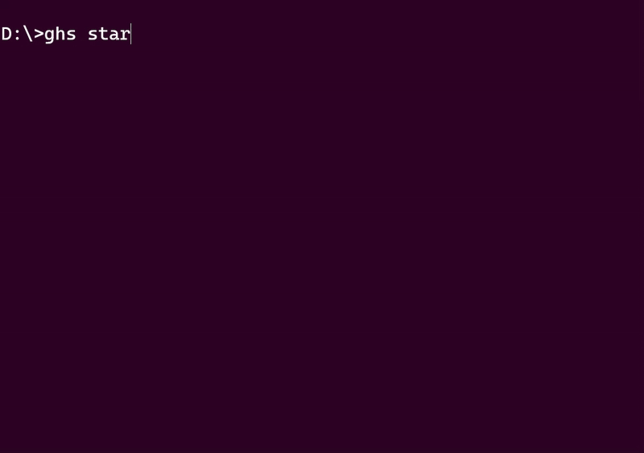

# GitHub-Sync (ghs)
GitHub-Sync (or ghs for short) is a CLI tool designed to fix your GitHub contribution graph.     
Ever coded for hours daily 🧑🏻‍💻, only to push your changes days later and have GitHub count it as a single contribution like you only worked that one day?   

Well, that's why I made this tool! It tracks your local coding activity and syncs it 🔗 with GitHub at regular intervals.    

## Why Use GitHub-Sync? 🤔   
You might be wondering, "Aren’t there already tools that can turn my GitHub contribution graph green without me even coding?" Well, yes, there are. But here’s the thing: GitHub-Sync isn’t about gaming the system.   

The purpose of GitHub-Sync is to accurately reflect your actual coding activity on your GitHub contribution graph. It’s not just turning your graph green for the sake of it:   

- **Fixes Your Contribution Graph:** Make it actually represent your work! 🌱
- **Tracks Coding Time:** Know exactly how much time you’ve spent coding. ⏳
- **Automates Commits:** Automatically commit and push your progress at set intervals. 🤖

---

## How It Works 🛠️
- **Detects Your Editor:** Detects when your code editor is open (e.g., VS Code, IntelliJ, Vim, etc.).
- **Tracks Coding Time:** It tracks how long you’ve been coding and commits your progress at regular intervals.
- **Creates Special Repo:** Creates a repo called Activities where the logs are being pushed.
- **Syncs with GitHub:** Your contributions are automatically pushed to GitHub, so your graph stays green. 🌱

---

## Commands 📄

<p align="center">
  
</p>

### Start ▶️
Start tracking your coding activity by running a background process until you reach the specified interval.
```sh
   ghs start
```

### Stop ⏹️
Stop the background process and halt tracking.
```sh
   ghs stop
```

### Status 📊
Get insights into your current tracking status.
```sh
   ghs status
```

### Configuration ⚙️
Update your GitHub Personal Access Token (PAT), activity, or commit frequency.
```sh
   ghs config --pat=<your_pat> --activity="Working on a cool project" --frequency=100
```

**Flags:**
- `--pat`: Your GitHub Personal Access Token (PAT).
- `--activity`: What you’re currently working on.
- `--frequency`: How often (in minutes) you want to push changes (minimum 100).

### Reset 🔄
Reset the tracked time and commit history.
```sh
   ghs reset
```

### Check Version ℹ️
Print the version number, build date, and Git commit.
```sh
   ghs version
```

---

## Installation 🛠️

### **Prerequisites**
- **Go:** Make sure Go is installed on your system.

### **GitHub PAT Permissions 🔐**
To use GitHub-Sync, you’ll need a GitHub Personal Access Token (PAT) with the following permissions:

- `repo`: Full control of private repositories.
- `read:user`: Read user profile data.

### **Linux/macOS**
Clone the repository:
```sh
   git clone https://github.com/mostafa-mahmood/GitHub-Sync.git
   cd GitHub-Sync
```
Run the installation script:
```sh
   ./install_linux.sh
```

### **Windows**
Clone the repository:
```sh
   git clone https://github.com/mostafa-mahmood/GitHub-Sync.git
   cd GitHub-Sync
```
Run the installation script:
```sh
   install_windows.bat
```

---

## Contributing 🤝
Contributions are welcome! If you have any ideas, bug fixes, or improvements, feel free to open an issue or submit a pull request.

## 📜 License
This project is licensed under the MIT License - see the [LICENSE](LICENSE) file for details.

## Happy Coding!
May your GitHub graph forever shine green! 🌱
